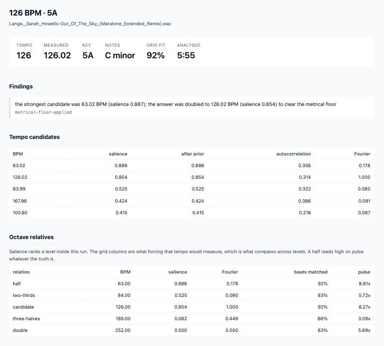
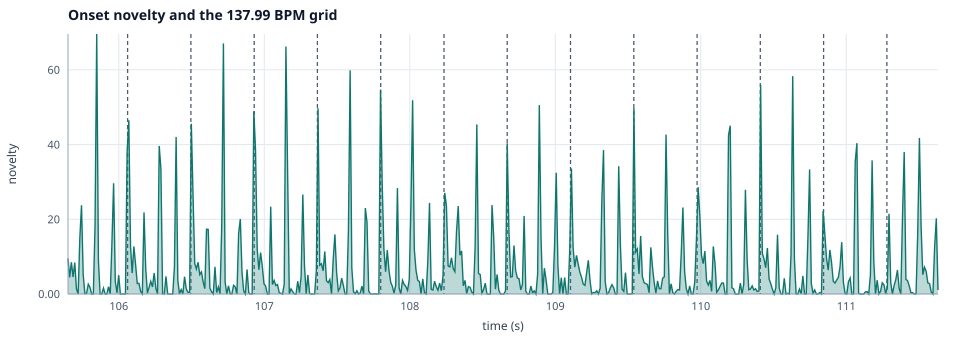
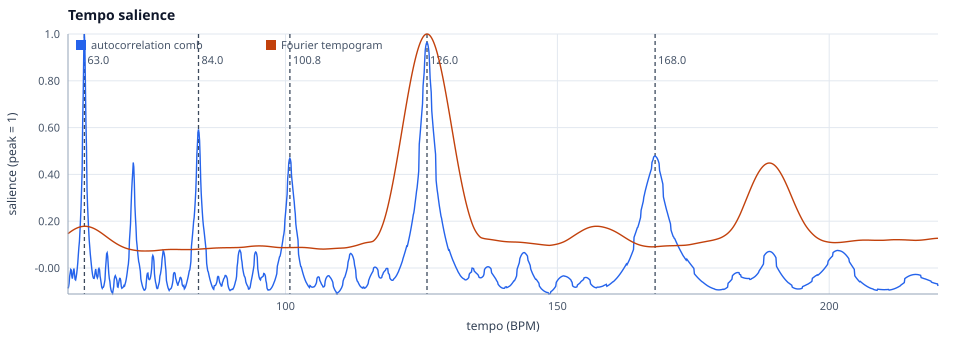
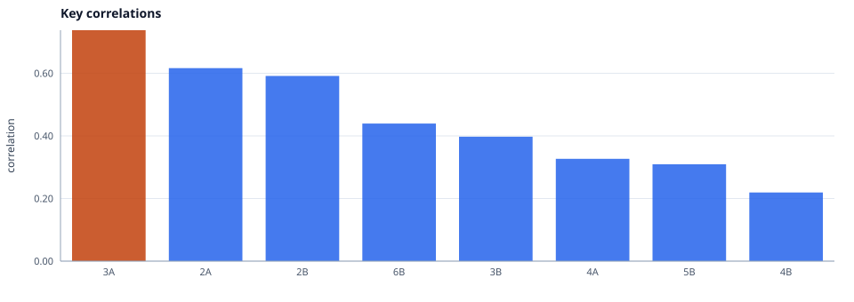

# Dubplate

Tempo and key analysis you can argue with, cut to a USB stick a player will read.

Most tools print one number. When that number is wrong, and for a track with a half-time
intro or an offbeat bassline it often is, there is nothing to inspect and no way to tell a
bad recording from a bad algorithm. This one writes out the curve the tempo came from, the
salience of every competing tempo, the beat grid drawn over the onsets it was fitted to, and
a list of the reasons it might be wrong. The answer is a claim with its evidence attached.

The same measurements then go onto a stick a player will browse. A Nix pipeline takes the
zips as they were downloaded, analyses every track in parallel, names each file after its
tempo and key, and writes a rekordbox database for Pioneer gear and an Engine Library for
Denon onto a FAT32 image, with the beat grids, cues and waveforms both read.

Keys are Camelot throughout: `8A` rather than `A minor`, on the terminal, in the report, in
the file names and in both databases.

Everything is measured on the file. Nothing is looked up, and the tool never talks to a
network.

---

## What a run gives you

One command on one track writes the page below. The track is a 126 BPM trance remix whose
metrical level is arguable, so the page has something to argue.

```sh
just analyze "Lange,_Sarah_Howells-Out_Of_The_Sky_(Maratone_Extended_Remix).wav"
```



The headline is the claim and the rest of the page is what backs it. The findings are the tool
disagreeing with itself, which no player's GUI will tell you, and the candidate table is the
ranking the answer came out of. Read that table before anything else here: 63.02 BPM scored
highest, at 0.886 against 0.854 for 126. The answer is 126 because the metrical floor doubled
the winner and the snap closed the last two hundredths, both saliences are printed so you can
see what the doubling cost, and the Fourier column is what says the floor was right, giving
126 a score of 1.000 and 63 a sixth of that.

The table below it fits a grid at every metrical level, so the comparison that settles an
octave is on the page rather than in a rerun. It also shows the trap: 63 BPM matches the same
92% of beats at a higher 8.81 times the track novelty, because every beat of a 63 BPM grid is
a beat of the 126 one. The two-thirds and three-halves levels are the ones a grid can reject,
and they read 83% and 86%.

### The grid drawn over the onsets



Six seconds of the curve every tempo number comes from, with the fitted grid over it.
Lines on the peaks mean the tempo is right, lines drifting off them across the window mean it
is close and wrong, and peaks with no line between them mean the grid sits at half the tempo
of the track.

### Where the octave was decided



Autocorrelation peaks at 63 BPM and the Fourier tempogram peaks at 126. This is the picture
behind the one finding on the page: the comb ranked half the tempo first, because every one of
its teeth still lands on a beat, and the Fourier tempogram has no energy to give it. The
marked candidates are the tempi an octave error lands on, which is why the report ranks 63, 84,
101 and 168 beside the winner rather than printing one number.

### The key and the margin behind it



5A wins on 0.725 with 6A next at 0.636, a margin of 0.12 that the report prints beside the
answer. Two bars of nearly equal height would be a tie the correlation cannot break, and the
pair in that case is usually a key and its relative, which share every note and share a number
on the wheel.

The page holds seven figures, five tables and every finding, and each figure carries a caption
saying what it would look like if the stage above it had gone wrong. `report.json` behind it
holds every number in all of them. The figures here come from that same command with
`--plot-window 6`, which narrows the novelty window from twelve seconds to six.

---

## In and out

Put the zips where they landed. Get a stick that plays.

```
  archives/*.zip          ┌──────────────────────────────┐        outputs.usb.wav  ──►  wav.img
  audio/*.wav             │  unpack, analyse each track  │        outputs.usb.flac ──►  flac.img
  audio/*.flac      ──►   │  in its own derivation,      │  ──►   outputs.usb.mp3  ──►  mp3.img
  audio/*.mp3             │  name, encode, write both    │        outputs.usb      ──►  all three
                          │  databases, make the image   │
                          └──────────────────────────────┘
```

Each image is one FAT32 filesystem, which is what a CDJ mounts and what a Denon deck reads
too, holding:

| On the image | For |
|---|---|
| `/Contents/126_05A_Artist-Title.flac` | The audio, named after its own tempo and key, zero padded so a plain listing sorts by tempo and then around the wheel. |
| `/PIONEER/rekordbox/export.pdb` | **Pioneer.** The DeviceSQL database a CDJ, XDJ or RX3 browses: tracks, artists, keys, one playlist. |
| `/PIONEER/USBANLZ/…/ANLZ0000.DAT` and `.EXT` | **Pioneer.** Per track: the beat grid, the cue, the monochrome waveforms and the colour pair a Nexus 2 or newer draws. |
| `/Engine Library/Database2/m.db` | **Denon.** Engine schema 2.21.2, which Engine DJ 2 and 3 read: tempo, key, beat grid, cue slots, overview waveform. |

Both databases go on every image. They read different directories, neither player looks at
the other's, and the audio is shared, so one stick works in whichever booth you walk into.

A WAV lands in all three images, encoded to FLAC and MP3 on the way. A FLAC or an MP3 lands
in its own format only, because transcoding a lossy source spends CPU to lose more.

```sh
just usb flac        # or: just usb, for all three
```

`devenv build` prints the store path it wrote, and the image is inside it. Copying one to a
stick is `dd`, so read the disk number twice:

```sh
dd if=/nix/store/…-usb-flac.img/usb-flac.img of=/dev/diskN bs=4m
```

---

## Tutorial

A first pass, from a checkout to a report you can read. Roughly ten minutes, and you need one
WAV file.

1. **Enter the dev shell.** It provides the pinned Rust toolchain, `just`, `treefmt` and
   `crate2nix`.

   ```sh
   direnv allow        # or, without direnv:  devenv shell
   ```

2. **Measure something with a known answer.** The selftest generates a pulse train at a tempo
   you name and runs the whole pipeline over it.

   ```sh
   just selftest --bpm 174
   ```

   ```
   generated 174.00 BPM, measured 173.97 BPM, error 0.026 BPM (0.02%)
   ```

   A failure here is a defect in this repo. Every later surprise is about the track.

3. **Analyse a track.**

   ```sh
   just analyze "Lange,_Sarah_Howells-Out_Of_The_Sky_(Maratone_Extended_Remix).wav"
   ```

   ```
   126 BPM   5A   5:55 analysed
     measured  126.02 BPM, snapped -0.02 BPM to a whole number
     grid      92% of beats within 50 ms, pulse 8.27x the mean, bar phase 1 (contrast 1.47)
     windows   median 126.02 BPM, spread 0.01 BPM, 88% agree
     also      63.02 (0.89), 83.99 (0.52), 167.96 (0.42)
     - metrical-floor-applied: the strongest candidate was 63.02 BPM (salience 0.887); the
       answer was doubled to 126.02 BPM (salience 0.854) to clear the metrical floor
     wrote     analysis/Lange,_Sarah_Howells-Out_Of_The_Sky_(Maratone_Extended_Remix)/report.html
   ```

   The answer is 126, because somebody typed 126 into a sequencer and the two hundredths the
   estimator produced are its own error. The second line says how far it had to move, and the
   grid was fitted at 126 rather than at the measurement.

   Read the grid line next. 92% of beats landed within 50 ms of an onset and the grid sits on
   novelty eight times the track mean, so 126 describes this track. The `-` line is the tool
   telling you the number it reported is not the number that won, and step 5 is where you
   check it.

4. **Open the report.**

   ```sh
   open analysis/*/report.html
   ```

   Seven figures, each captioned with what it would look like if the stage above it had gone
   wrong. Start with the novelty plot. Grid lines sitting on the peaks mean the tempo is
   right; lines drifting off them across the window mean it is close and wrong.

5. **Check the level the floor rejected.** The finding says 63.02 BPM scored higher than the
   answer. Report it and compare the two runs:

   ```sh
   just analyze "Lange,_Sarah_Howells-Out_Of_The_Sky_(Maratone_Extended_Remix).wav" --metrical-floor 0
   ```

   ```
   63 BPM   5A   5:55 analysed
     measured  63.02 BPM, snapped -0.02 BPM to a whole number
     grid      92% of beats within 50 ms, pulse 8.81x the mean, bar phase 1 (contrast 1.41)
     windows   median 63.00 BPM, spread 63.00 BPM, 74% agree
   ```

   The grid cannot separate these two. Every beat of a 63 BPM grid is a beat of the 126 one,
   so 92% of them land on an onset either way and the pulse ratio even goes up, because half
   as many beats are being asked to find one.

   Two other numbers do separate them. The windows line collapses: at 126 the twenty-second
   estimates spread over 0.01 BPM and 88% agree, at 63 they spread over 63 BPM and 74% agree,
   which is the same track measured as two different things depending on the window. And the
   Fourier column of the candidate table gives 126 BPM 1.000 against 0.178 for 63, because it
   measures energy at a beat frequency and there is none at 63. 126 stands.

6. **See a knob change the answer.** That last run is the knob. The metrical floor is what
   turned 63 into 126, and turning it off reports what the salience curve actually says.
   Neither run is lying. One of them applies a rule about how dance music is counted, and it
   says so in the findings. To see the measurements with no rule applied at all, add
   `--integer-snap 0` and the headline reads 63.02.

7. **Put it on a stick.** The same analysis, run over a whole library and written where a
   player looks for it:

   ```sh
   mkdir -p audio
   cp "Lange,_Sarah_Howells-Out_Of_The_Sky_(Maratone_Extended_Remix).wav" audio/
   just usb flac
   ```

   Nix analyses each track in its own derivation, using the tool you just ran by hand, and
   builds a FAT32 image holding `Contents/126_05A_Lange,_Sarah_Howells-Out_Of_The_Sky_(Maratone_Extended_Remix).flac`,
   a rekordbox database and an Engine Library. Copy it over with `dd` and the deck reads the
   tempo, the key, the grid and the waveform without analysing anything itself.

You now know both loops: read the headline, read the findings, report the competing level and
compare what the two runs measured; then let the pipeline do the same to everything and write
the result where a player reads it. The [how-to guides](#how-to-guides) cover the rest of the tasks,
[docs/02-troubleshooting-a-tempo.md](docs/02-troubleshooting-a-tempo.md) is the decision
procedure keyed on the diagnostic codes, and
[docs/04-device-export.md](docs/04-device-export.md) says exactly what lands on the stick.

---

## How-to guides

### Analyse one section instead of the whole track

An intro at half time, or a breakdown with no drums, drags the whole-track average with it.
Cut to the part you care about:

```sh
just analyze track.wav --start 90 --duration 60
```

Beat times in `report.json` are then relative to the excerpt, and `source.analysed_start_seconds`
records where it began.

### Find out which frequencies decided the tempo

The report has a tempo per onset band. A kick at 150 and hats at 100 is a shuffle or a
polyrhythm, and the broadband estimate lands between them:

```sh
jq '.bands[] | "\(.low_hz | round)-\(.high_hz | round) Hz: \(.bpm)"' analysis/*/report.json
```

Then narrow the onset detector to the band that agrees with your ears with `--onset-bands`,
and rerun.

### Force a metrical level

To hear the tool out on a tempo it rejected, restrict the search range rather than arguing
with the salience:

```sh
just analyze track.wav --min-bpm 155 --max-bpm 165
```

Compare `grid.matched_fraction` and `grid.pulse_ratio` against the original run. Higher on
both is the right level, whatever the salience curve ranked first.

### See the measurement behind a rounded tempo

The headline is a whole number, because a produced track has the tempo somebody typed in. The
measurement is in the report and on the second line of the summary whenever the two differ:

```sh
jq '{reported: .tempo.bpm, measured: .tempo.bpm_measured}' analysis/*/report.json
```

A gap of a few hundredths is this tool's own error. A gap near the quarter-BPM tolerance is
worth reading `tempo-over-time.svg` for. To turn the rounding off everywhere, including in the
grid, the file name and both databases:

```sh
just analyze track.wav --integer-snap 0
```

A track measured further from a whole number than the tolerance allows keeps its decimals and
raises `non-integer-tempo`, which usually means it was played rather than rendered.

### See what a tempo prior would do

Detectors that report a plausible answer to everything usually have a prior. This one has
none unless you ask:

```sh
just analyze track.wav --tempo-prior 128 --tempo-prior-width 0.4
```

The report then carries `candidates_without_prior`, and a `prior-changed-answer` finding
fires when the prior, rather than the track, picked the winner.

### Check whether a file came from a lossy source

`spectrum.high_cutoff_hz` is the highest frequency still within 40 dB of the peak. A hard
ceiling at 16 kHz or 19 kHz is a transcode, whatever the extension says:

```sh
jq '.spectrum' analysis/*/report.json
```

The spectrogram shows the same thing as a flat black band across the top.

### Trust a key estimate, or not

Read `key.tuning_cents` first. Beyond about 15 cents the track is not at A = 440 Hz, the
chroma mapping was shifted to compensate, and any tool that skipped that step read a
different set of notes. Then read `key.margin`. Under 0.05 the winner and the runner-up are
indistinguishable, and they are usually a key and its relative, which share every note and,
on the wheel, share a number: `8A` against `8B`.

Keys are reported in Camelot. `key.name` in the report and the second column of the key table
on the page carry the same key as notes, for when that is what you want.

Both profiles are available, and they disagree on tracks built from a repeating loop:

```sh
just analyze track.wav --key-profile krumhansl
```

### Name a library after what is in it

`rename` prints the name a file should carry: the tempo padded to three digits, the Camelot
key padded to two, then the name the file already had.

```sh
just rename "Lange,_Sarah_Howells-Out_Of_The_Sky_(Maratone_Extended_Remix).wav"
```

```
126_05A_Lange,_Sarah_Howells-Out_Of_The_Sky_(Maratone_Extended_Remix).wav
```

Padding is the point. A plain `ls` then sorts by tempo and, within a tempo, around the Camelot
wheel, which is the order you want when building a set. Nothing is renamed in place: pass
`--out` with `--mode symlink` or `--mode copy` to write a named collection somewhere else, and
run it again after a flag change to replace the prefix rather than stack a second one.

### Build a whole library from the zips you downloaded

```sh
mkdir -p archives                       # or symlink it at wherever the zips live
cp ~/Downloads/beatport_tracks_*.zip archives/
just library
```

That gives the named files without building an image, which is what you want when the
destination is a hard drive rather than a stick. Take all three formats or one:

```sh
devenv build outputs.library         # wav/ flac/ mp3/ side by side
devenv build outputs.library.flac    # one format, plus .analysis for the reports
```

Each track inside each archive becomes its own derivation, so Nix analyses as many at once as
it builds anything else, and one bad file fails one track rather than the batch. Loose files
work too: put them in `audio/` instead of zipping them.

### Build a USB stick for a CDJ or a Denon deck

```sh
just usb flac                   # or wav, or mp3, or `just usb` for all three
```

devenv prints the store path it built. The image is the `.img` file inside it, so copying to
a stick reads:

```sh
dd if=/nix/store/…-usb-flac.img/usb-flac.img of=/dev/diskN bs=4m   # check the disk twice
```

Building `outputs.usb` instead gives one directory of all three, named `wav.img`, `flac.img`
and `mp3.img`. Beside each single image is `device`, a link to the databases on their own,
which is what to read when a player refuses a stick.

The databases and the audio are separate derivations, so changing a database field does not
recopy several gigabytes of audio.

### Look at a device tree without building an image

```sh
just export /tmp/device --audio path/to/audio --reports path/to/reports
```

Writes `PIONEER/rekordbox/export.pdb` and `PIONEER/USBANLZ/…` and nothing else. Reports come
from `just analyze`; audio and reports are paired by file stem. Everything the databases
contain, and everything they do not, is in
[docs/04-device-export.md](docs/04-device-export.md).

### Add a dependency

```sh
just sync-cargo-nix     # regenerate the crate graph
just check              # includes the staleness check CI runs
```

The pre-commit hook regenerates `Cargo.nix` for you when a manifest changes. CI fails if the
committed graph and the manifests disagree.

---

## Reference

### Repository layout

| Path | What it is |
|---|---|
| `libraries/rust/audio/` | WAV decode, mono downmix, excerpting, and the synthesised signals the tests measure against. |
| `libraries/rust/spectral/` | The STFT, log-spaced frequency bands, chroma folding, tuning estimation. |
| `libraries/rust/tempo/` | Novelty curves, tempo salience, beat grid fitting, and the rules that name a doubtful answer. |
| `libraries/rust/key-detect/` | Chroma to key by profile correlation, in Camelot notation. |
| `libraries/rust/diagnostics/` | The finding type every stage reports its doubts in. |
| `libraries/rust/report/` | The JSON report, the SVG plots, the PNG spectrogram, the HTML page. |
| `tools/rust/dubplate/` | The CLI: one analysis pass, one output directory. |
| `libraries/rust/collection/` | The device-neutral track model both exporters read, and the reader that builds it from a report. |
| `libraries/rust/waveform/` | The two waveforms a player draws, at the resolutions their formats read. |
| `libraries/rust/rekordbox/` | `export.pdb` and the `ANLZ` files, with the reference parser as the test oracle. |
| `libraries/rust/engine/` | The Engine Library database Denon players read, schema 2.21.2. |
| `nix/library.nix` | The archive pipeline: zips in, three named format directories out. |
| `nix/device.nix` | The device tree and the FAT32 image built from it. |
| `infrastructure/ci-cd/` | The CI workflows, as a cdkactions app. `.github/workflows/` is generated from it. |
| `docs/` | `01-signal-chain`, `02-troubleshooting-a-tempo`, `03-report-reference`, `04-device-export`, and `images/` for the figures this page shows. |
| `Cargo.nix` | The crate graph, generated by crate2nix. Never hand-edited. |
| `devenv.nix`, `treefmt.nix` | The dev shell, the Nix build, and the formatter set. |

Packages are grouped by structural role first and by language second, so a crate's home
follows from what it is rather than from what it is about. Reusable analysis stages go in
`libraries/rust/`, things you run go in `tools/rust/`. Both are globs in the workspace
manifest, so adding a crate does not mean editing `Cargo.toml`.

### Commands

| Command | Does |
|---|---|
| `just check` | The full PR gate: formatting, clippy, tests, crate-graph staleness. |
| `just analyze <file> [flags]` | Analyse a file and write a report directory. |
| `just rename <path>...` | Print, link or copy files named after what was measured in them. |
| `just library` | Build every archive in `archives/` into `wav/`, `flac/` and `mp3/`. |
| `just usb [format]` | Build FAT32 images, all three or one, databases and all. |
| `just export <dir>` | Write a device tree from a directory of audio and reports. |
| `just selftest [--bpm N]` | Measure a generated pulse train end to end. |
| `just test` / `lint` / `fmt` | `cargo test` / clippy with warnings fatal / `treefmt`. |
| `just sync-cargo-nix` | Regenerate `Cargo.nix` after a dependency change. |
| `just synth-workflows` | Regenerate `.github/workflows/` from `infrastructure/ci-cd`. |
| `just build-nix` | Build the CLI through Nix, against the committed crate graph. |

### Output files

A run writes one directory per track. `report.json` is the contract: every number in the
terminal summary, in the HTML page and in the plots comes from it.

| File | What it holds |
|---|---|
| `report.json` | Every measurement, every candidate, every finding. |
| `report.html` | The page: headline, findings, five tables, seven figures. |
| `spectrogram.png` + `.svg` | Time against log frequency. The SVG carries the axes. |
| `spectrum.svg` | Long-term average spectrum on a log frequency axis. |
| `novelty.svg` | The onset curve with the beat grid drawn over it. |
| `tempo-salience.svg` | Both estimators across the BPM range, candidates marked. |
| `tempo-over-time.svg` | One independent estimate per twenty-second window. |
| `chroma.svg`, `key-correlations.svg` | Pitch-class energy and the ranked keys. |

Every flag, every JSON field and every diagnostic code is in
[docs/03-report-reference.md](docs/03-report-reference.md); everything the device export
writes is in [docs/04-device-export.md](docs/04-device-export.md).

### Nix outputs

Both trees nest, so a build takes the lot or one format of it.

| Output | What it is |
|---|---|
| `outputs.dubplate` | The CLI, built through the committed crate graph. |
| `outputs.library` | Every track named `<BPM>_<KEY>_<original name>`, the three formats side by side. |
| `outputs.library.flac` | One format. `.wav` and `.mp3` likewise; `.analysis` holds the reports. |
| `outputs.usb` | A FAT32 image per format, side by side as `wav.img`, `flac.img`, `mp3.img`. |
| `outputs.usb.flac` | One image, with `device` beside it linking the databases on their own. |

`library` is one derivation with several outputs; `usb` is three derivations behind one,
since each image is built from different audio.

### Input format

The analyser reads WAV: any sample rate, any channel count, 16, 24 or 32-bit integer or float.
Channels are averaged to mono and nothing is resampled. It refuses anything shorter than 30
seconds rather than reporting a tempo it measured once.

The pipeline takes WAV, FLAC and MP3 out of the archives and decodes the last two with `flac`
and `lame` before the analyser sees them, which keeps one decoder per format and each of them
the reference implementation for it.

---

## Explanation

### Everything hangs off the novelty curve

The pipeline is short on purpose. One pass of the short-time Fourier transform produces
energy in eight log-spaced bands per frame; the difference between consecutive frames, log
compressed and with a moving average subtracted, is the novelty curve; every tempo number in
the report is a statement about that one curve. So when a tempo is wrong there are only two
possibilities, and the novelty plot separates them. Either the pulse is not in the curve,
which is a problem with onset detection or with the track, or it is in the curve and the
estimator picked the wrong period.

Keeping the pipeline shallow costs accuracy that a deeper model would win back. It buys the
thing this tool exists for, which is that every intermediate value has a plot and a name.

### Two estimators, kept separate

Autocorrelation asks how self-similar the curve is at a lag of one beat. The Fourier
tempogram asks how much energy sits at a beat frequency. They fail differently. Autocorrelation
is confused by a swung or shuffled pulse, and the Fourier tempogram is confused by a tempo
that drifts. Neither is corrected against the other, and neither vote is averaged in. When
they disagree the report says so, with both numbers, because a disagreement names the thing
to look at next and an average hides it.

### The octave problem, and the one rule that resolves it

A harmonic sum scores half the true tempo almost as highly as the truth, since every one of
its comb teeth still lands on a beat. Subtracting the autocorrelation halfway between the
teeth argues against that, and it is the standard fix, but it argues just as hard against the
true tempo of anything with offbeat movement. On a 160 BPM hardstyle track whose reverse bass
sits on every offbeat, that penalty at full weight reports 106.64 BPM, which is not even an
octave relative of the truth. So the penalty is off by default and `--comb-penalty` exposes
it.

What resolves the octave instead is a stated rule rather than a hidden one. The reported
tempo is doubled until it clears 90 BPM, provided the doubled candidate still scores at least
half of the original. Nothing in club music is counted below that; a track that measures at 70
is being counted in half bars. Across the eighteen-track working set this doubling fires five
times, and every time it does the report carries a `metrical-floor-applied` finding with both
saliences, so the decision is visible and `--metrical-floor 0` undoes it.

The rule is a convention, so the report also carries the measurement that can argue with it.
A grid is fitted at every metrical level, not just the reported one, and each carries the
beats it matched and the novelty it sits on. That is the comparison the troubleshooting guide
used to describe as a rerun, and it now takes five phase searches over a curve the run already
has. When a two-thirds or three-halves level fits better than the answer, `level-fits-better`
says so with both sets of numbers. Nothing in the working set raises it, and forcing a wrong
level on any track does.

A half is the exception, and stating why matters more than the number. A grid at half the
tempo reads higher on pulse ratio whatever the truth is, because every one of its beats is a
beat of the real grid and half as many beats have to find an onset. So the finding ignores
halves, and the report's own example shows the trap: on the track above, 63 BPM matches the
same 92% of beats at 8.8 times the track novelty against 8.3 for 126. What separates them is
the Fourier salience, 1.000 against 0.178, and the window spread, 0.01 BPM against 63.

### The answer is a whole number

A produced track has the tempo somebody typed into a sequencer, and nobody types 126.02. So
the estimator's decimals are the estimator's error, and reporting them states a precision the
track does not have. The reported tempo is the nearest whole number, `bpm_measured` keeps what
was measured, and the headline prints the gap whenever it moved the answer.

The snap runs before the grid is fitted rather than at the point of printing, because the file
name, the beat grid, the rekordbox database and the Engine Library all take the reported
number, and a grid fitted at 126.02 under an answer of 126 is a grid nobody can check the
answer against. Fitting at the whole number turns out to fit better: across the working set
the grid improved on twelve of eighteen tracks, held on three and lost a point or two on
three. The largest gain took a 125 BPM deep house track from 88% of beats matched to 100%, and
its grid from twice the track novelty to six and a half times it.

The tolerance is a quarter of a BPM, which is wider than the 0.1 BPM candidate grid and than
the 0.065 BPM the selftest misses a generated 200 BPM pulse train by, and much narrower than
the half a BPM that would round everything. A track measuring 0.38 BPM off an integer was
played rather than rendered, and rounding it would write a grid that drifts a beat every two
minutes onto a stick. Those keep their measurement and raise `non-integer-tempo`. Across the
working set every track snapped, by at most 0.164 BPM.

One thing the snap costs: on some tracks a two-thirds relative now fits almost as well as the
answer, because two beats in three of a 92 BPM grid land exactly on a 138 BPM beat once both
tempi are whole. On one track in the working set that comparison came out 6.38 against 5.89,
where before the snap it was 4.98 against 2.26. The pulse ratio still favours the truth, and
the number that separates the two by an order of magnitude is the Fourier salience.

### No tempo prior unless you ask

Most detectors weight candidates towards 120 BPM. It improves the average case and it is
exactly how a 174 BPM drum and bass track gets reported as 87. Here the prior is off, and
switching it on with `--tempo-prior` makes the report carry the ranking it would have produced
without one. When the prior rather than the track picked the winner, that is a finding.

### The findings are not warnings about the tool

A finding is a measured disagreement, not a confidence score. `grid-misfit` means fewer than
half the beats landed near an onset, which is a statement about whether a constant tempo
describes the track at all. `flat-chroma` means pitch-class energy is nearly uniform, so the
key ranking below it is arbitrary however good its correlations look. Five of the eighteen
tracks in the working set raise nothing. That is the point of not raising something on every
one.

### Writing a player's database

A CDJ does not read a folder of files. It reads `export.pdb`, a DeviceSQL database of pages
and row groups, and two analysis files per track holding the beat grid, the cues and the
waveforms. No open tool writes them. rekordcrate, which is the reference implementation of
the format analysis, parses a database and can modify one, but keeps every row field private,
so it can check this output and cannot produce it.

So the writer here is ours, and rekordcrate is the oracle: the tests write a database and read
it back through its own parser, across page boundaries, through the UTF-16 string encoding,
and into the playlist entries. That is the strongest check available without hardware. It says
the file is well formed and the values survive; it does not say a player accepts it, and no
CDJ has read one of these sticks yet. The fields whose purpose nobody has established carry the
constants that appear in real exports, and they are named as unknown where they are written.

Denon's side is easier and harder. Easier because the database is SQLite and its schema is
recorded in libdjinterop, so the file is checked by its own constraints and triggers as it is
written. Harder because there is no parser to disagree with: the analysis lives in five
compressed binary columns, and a mistake inside one of them is a blob that decompresses to the
wrong numbers rather than a database that fails to open. The tests decode each blob back and
check the framing, the byte order and the values.

### One derivation per track

The archive pipeline could be a shell script over a directory. It is a derivation per track
instead, for three reasons that a script gives up. Nix schedules the analyses the way it
schedules any other build, so the parallelism is whatever the machine is already set to. A
track that fails to decode fails alone and names itself. And a rebuild after a flag change
reanalyses nothing that did not change, which matters at a second per track across a library
of hundreds.

The cost is import from derivation. Nothing in Nix can list the contents of a zip without
unpacking one, so the archive is imported into the store and a manifest is built and read
during evaluation. On a gigabyte of downloads the first run says nothing for as long as that
copy takes.

### Keys are Camelot

`8A` says two things a DJ acts on: which key, and which keys mix with it. `A minor` says one
of them and leaves the other as a piece of theory to do in your head at the wrong moment. So
the wheel is what the terminal prints, what the file names carry, what the rekordbox database
stores for a player to display and sort by, and what Engine gets as its key number.

The musical name is still measured and still in the report, as `key.name` and as a column on
the page. Nothing is lost; the reading order is just the one that matches how the answer gets
used.

### Why Rust, and why the graph is committed

The hot loops are a transform over tens of millions of samples and an autocorrelation over
tens of thousands of frames. A seven-minute track analyses in about a second, which is what
makes a flag sweep across a library a thing you actually do rather than a thing you plan.

`Cargo.nix` is the crate graph, resolved ahead of time by crate2nix and committed. Nix reads
it and builds every dependency with the compiler pinned in `rust-toolchain.toml`, so nothing
resolves or fetches while the build is being evaluated. The cost is that the file goes stale
silently, which is why a pre-commit hook regenerates it whenever a manifest changes and CI
fails when the two disagree.
